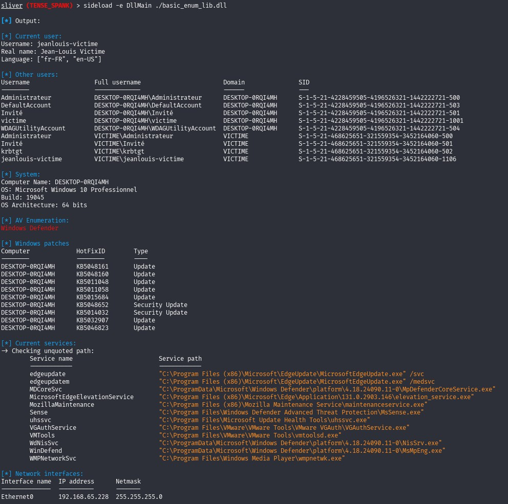

# Enum.rs
<hr />
<h2>🤔 What is Enum.rs ?</h2>
<div align="justify">
Enum.rs is a DLL that can be used as part of a pentest and/or red team.
This DLL retrieves information about Windows systems.
For example :
<ul>
  <li>Information about the current user ;</li>
  <li>Information about other users;</li>
  <li>Basic system information (OS, architecture, build version)</li>
  <li>Installed anti-virus potential;</li>
  <li>List of installed Windows patches;</li>
  <li>Potential services with an unquoted path;</li>
  <li>Network interfaces (with IP address and netmask).</li>
</ul>
</div>

<h2>🛠️ Installation steps</h2>

<p>1. Clone this repository</p>

```
git clone https://github.com/coili/enum.rs.git
```

<br />
<p>2. Build the DLL</p>

```
cargo build --release
```

To cross-compile, you can use [cross-rs](https://github.com/cross-rs/cross) and Docker.

```
cross build --target x86_64-pc-windows-gnu --release
```

The DLL will be compiled in the target/release folder (or target/x86_64-pc-windows-gnu/release).


<h2>📸 Screenshot using Sliver C2 (tool still WIP)</h2>

